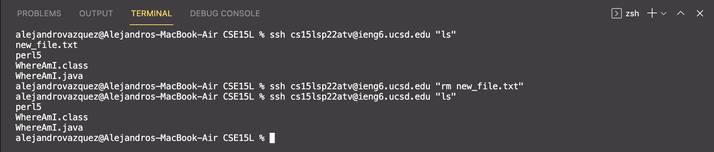

# Lab Report 1
This report covers how to log into a course-specific account on `ieng6`.

Step 1: Install Visual Studio Code
---
Visual Studio Code is an Integrated Development Environment (IDE) that is used to maximize programmer efficiency thanks to featureslike syntax highlighting, autocomplete, support for multiple languages, debugging, and more.

First go to https://code.visualstudio.com/download and download VSCode for your operating system. You should see the page below. Because I am on MacOS, the rest of the steps in this guide will pertain to the MacOS operating system.

Once you have it downloaded, open VSCode. It should look like the screenshot below.

Step 2: Remotely Connecting
---
In order to connect to a remote computer over the internet, you must first open a terminal by clicking 'Ctrl + \`' (or by clicking 'Terminal' > 'New Terminal' in the menu bar). Next, use the following ssh command to connect to the remote computer: 

`ssh cs15lsp22zz@ieng6.ucsd.edu` 

* IMPORTANT: replace zz with the letters associated with your account
* SSH stands for Secure Socket Shell and is a protocol which allows you to connect securely to a remote computer or server
* After running the command, you should see the following: 

Step 3: Try out some commands
---
Below are some examples of commands you can try.

 In the example above I created a new directory called test_directory using the `mkdir` command. Then I navigated to the directory using the `cd` command. Then I navigated back to the parent directory using the `cd ..` command. Next I deleted the directory using the `rmdir` command.

 In this example, I used the command `ls` to list the files in my current directory. Then I used the `rm` command to remove the files.

 In this example I created a text file called hello.txt using the `cat` command, and I appended some text to it. Then I ran the command `cat hello.txt` to print the contents of the file.

 In the example above, I created three new text files using the `touch` command. Then I once again used the `ls` command to see the files in my current directory, which displayed the new files I created. Then I used the `rm` command followed by the names of the three files to delete them all in one line.

Step 4: Moving files with `scp`
---
An important part of working through a remote computer is being able to securely copy files back and forth between your local computer and the remote host. You can do this using the `scp` command, which stands for secure copy. To securely copy a file from the client (your local computer) to the remote computer, use the following command:

`scp fileName.java cs15lsp22zz@ieng6.ucsd.edu:~/`

Below is an example of creating a file called WhereAmI.java on my local computer, securely copying it to the remote computer, and then running it on the remote computer. As expected, running the file gives a different output depending on where it is being ran from.

Step 5: Setting an SSH key
---
In order to make working through a remote computer more efficient, it would help if we didn't have to re-type our password every time we use `ssh` or `scp`. Thankfully, we can set an SSH key to do just that. Run the following command to set an SSH key:

`ssh-keygen`

* This creates public and private keys which are stored on the server and client
* We need to copy the public key to the .ssh directory of the remote server
* Running the command above will first ask you the directory to save the public key to on your local computer, and then ask for a passphase (not needed)
* Before logging into the remote server, you must first copy the *public* key to the .ssh directory of your user account on the server (you may need to login and create a .ssh directory using the command `mkdir .ssh`)

Below is me connecting to the remote computer without needing to enter a password.

Step 6: Optimizing Remote Running
---
To make the process of working between a local and remote computer even faster, we can do the following:

* Write a command in quotes at the and of an `ssh` command to directly run it on the remote server, like so: 
* Use semicolons to run multiple commands in the same line, like in the screenshot below. In this example, I connected to the remote server, compiled WhereAmI.java, ran it, and exited the remote server in the same line. 
* Use the up arrow to recall the last command that was run

