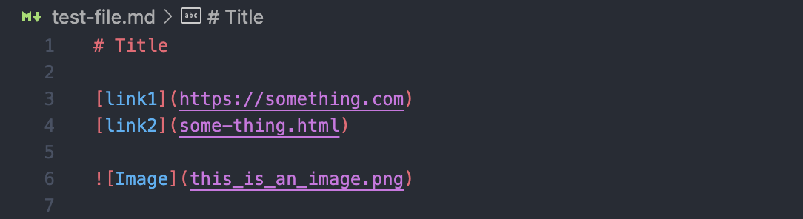
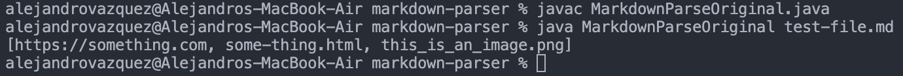
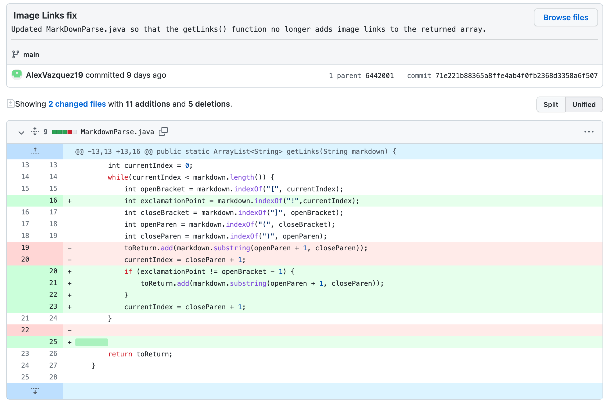
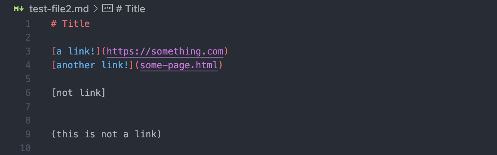
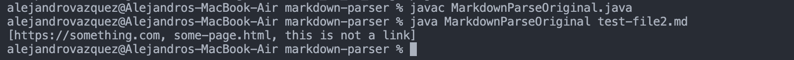
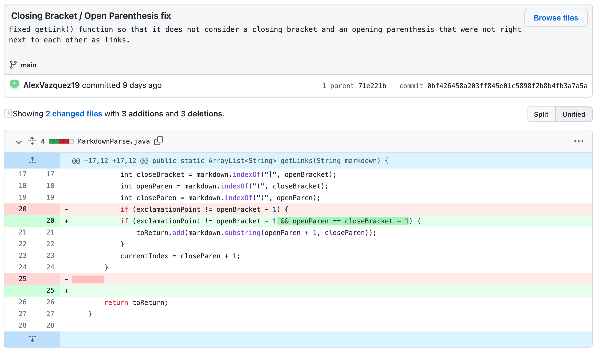
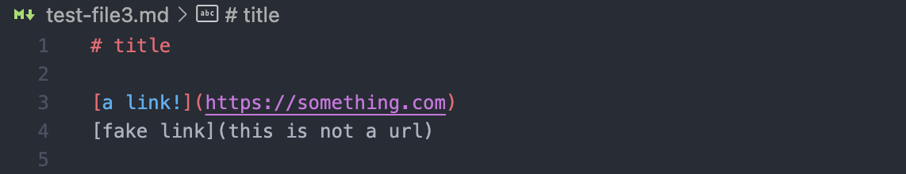
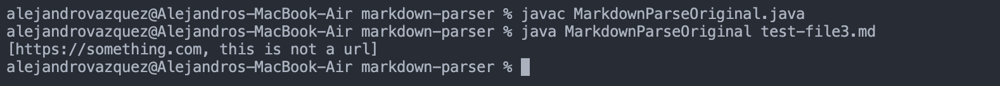
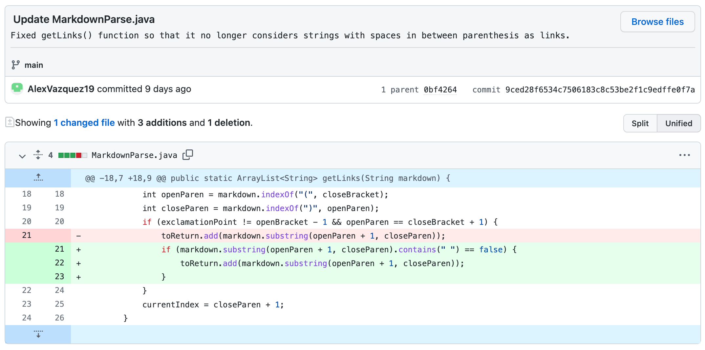

# Lab Report 2
This report covers three code changes from lab 3 that fixed bugs in the original code.

Change 1
---
The first bug that I encountered was that MarkdownParse.java would incorrectly return image links in the output list. Below is the test file that contains an image, which leads to the incorrect output. [Here is the link to the failure inducing input file.](https://github.com/AlexVazquez19/markdown-parser/blob/main/test-file.md)

Because the original code only identifies URLs by finding a set of brackets and parenthesis, it will also capture image links since images also use brackets and parenthesis. The resulting output is shown below. As you can see, the list includes the link to the image `this_is_an_image.png`.

In order to fix this bug, I made it so that the code would check if there was an exclamation mark before the first bracket before the link was added to the returned list. As you can see in the diff screenshot below, I added a new integer variable called `exclamationPoint` to get the index of the first exclamation point from `currentIndex`. Then I added an if statement that checks if the exclamation point index is right before the index for the first bracket (in other words, if `exclamationPoint` equals `openBracket` minus one). If it is, the link is for an image and is therefore not added to the final list to be returned.

***Relationship between bug, symptom, and failure inducing input:***

In this case, the bug was that the code would incorrectly capture image links and return them in the final output. The symptom was that the image links would be returned in the list and could be visibly seen by the user. The failure inducing input was any markdown file that conatained an image.

Change 2
---
The second bug I noticed was that MarkdownParse.java would think that any set of parenthesis after a set of brackets would be a link, and so it would still return the contents inside the parenthesis even if the brackets weren't directly behind them. Below is what the failure inducing test file looks like, and [here is a link to it.](https://github.com/AlexVazquez19/markdown-parser/blob/main/test-file2.md)

As you can see by the output below, the code incorrectly includes `this is not a link` in the output list.

In order to fix this bug, I added the line `&& openParen == closeBracket` to the if statement that adds the link to the returned list. This code checks if the index of the closing bracket is right before the index of the opening parenthesis, and if not then the text within the parenthesis will not be added to the list to be returned.

***Relationship between bug, symptom, and failure inducing input:***

In this case, the bug was that the code would return text that was in between parenthesis as long as it came after a set of brackets, no matter how far apart the brackets and parenthesis may be. The symptom was the actual text being returned in the list (the output including `this is not a link` as seen above). The failure inducing input was any markdown file that contains a set of parenthesis following a set of brackets with space between them.

Change 3
---
The final bug I encountered was that the original code would consider any text in between parenthesis as a link (given that the parenthesis are preceded by a pair of brackets). Take a look at the [failure inducing test file](https://github.com/AlexVazquez19/markdown-parser/blob/main/test-file3.md) below.

When running the code on this file, the returned list will mistakenly include `this is not a url`, as seen in the screenshot below. Obviously, `this is not a url` is not an actual URL and thus should not be considered one by the code.

I fixed this bug by adding the line `markdown.substring(openParen + 1, closeParen).contains(" ") == false`. This line ensures that there is no space inside the text that is in the parenthesis before adding it to the list to be returned. My reasoning behind this is that URLs will never contain a space, so it is a good way to reduce the number of failure inducing inputs. Unfortunately, I understand this fix is not all-encompassing because text that has no spaces (such as `thisisnotaurl`) would still be returned.

***Relationship between bug, symptom, and failure inducing input:***

In this example, the bug was that the code would return any text inside the parenthesis, regardless of whether it was actually a URL or not. The symptom was the code including text that is not a URL in the output list (`this is not a url` in the example above). The failure inducing input was any markdown file that contained the correct syntax for making a URL, except that the parenthesis did not actually contain a URL (i.e. `[link](not a link)`).
