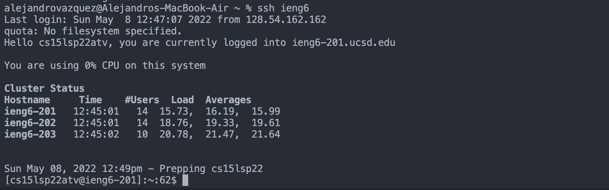

# Lab Report 3
This report outlines the three additional group choice tasks from Lab 5.

Streamlining `ssh` Configuration
---
When logging into the remote server, I normally have to type `ssh cs15lsp22atv@ieng6.ucsd.edu`. This is a lot to type and can use up a lot of time if I need to frequently reconnect to the server. This is where streamlining the `ssh` configurations comes in handy to save time and make it so you don't have to memorize as much.

The first step is to navigate to the .ssh directory and create a config file. I navigated to the .ssh directory using the `cd .ssh` command and created a config file using the `touch config` command.

After creating the file, I opened it using the `open config` command. This opened the file in a new window for me to edit, as seen below. I edited the file to include the host name and my user ID.

After saving the file, I then connected to the remote server by typing `ssh ieng6`. This is much shorter than what I previosuly had to type. If I wanted to, I could go back to the config file and change `ieng6` to whatever name I want, as it's basically just a nickname for the host and user given below it.

Setting up GitHub access from `ieng6`
---
