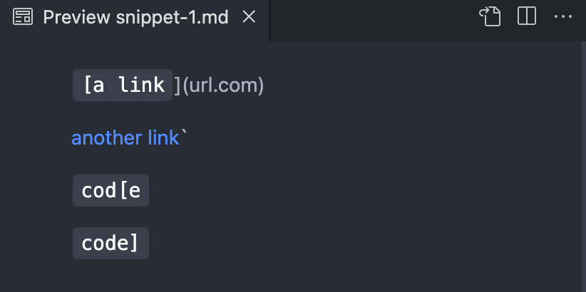

# Lab Report 4
My markdown-parse repository can be found [here](https://github.com/AlexVazquez19/markdown-parser-echidnas), and the repository that I reviewed in week 7 can be found [here](https://github.com/fnriv/markdown-parser). 

Snippet 1
---
Below is the VScode preview for the mardown file of snippet 1. Based on this preview, there are three links that should be captured by markdown-parse. The only invalid link is "url.com". However, the link for "another link" could also be considered invalid because it has a backtick. Therefore, if we **consider the first two links to be invalid**, the expected output should be:
```
[google.com, ucsd.edu]
```



I used the following code to turn this into a unit test:


Below is a screenshot of running the unit tests on my implementation of markdown-parse. My code failed because it included the two invalid links and did not include "ucsd.edu".


Below is a screenshot of running the unit tests on the repository I reviewed in week 7. Their code did a bit better because it captured "ucsd.edu", but like mine, it still included the two invalid links.


