# Lab Report 4
My markdown-parse repository can be found [here](https://github.com/AlexVazquez19/markdown-parser-echidnas), and the repository that I reviewed in week 7 can be found [here](https://github.com/fnriv/markdown-parser). 

Snippet 1
---
Below is the VScode preview for snippet 1. Based on this preview, there are three links that should be captured by markdown-parse based on syntax alone. However, the link for "another link" could also be considered invalid because it has a backtick. Therefore, if we **consider the first two links to be invalid**, the expected output should be:
```
[google.com, ucsd.edu]
```

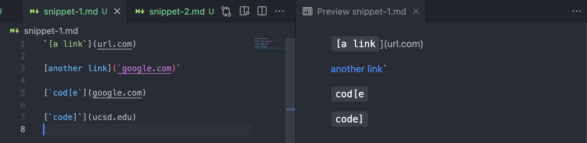

I used the following code to turn this into a unit test:

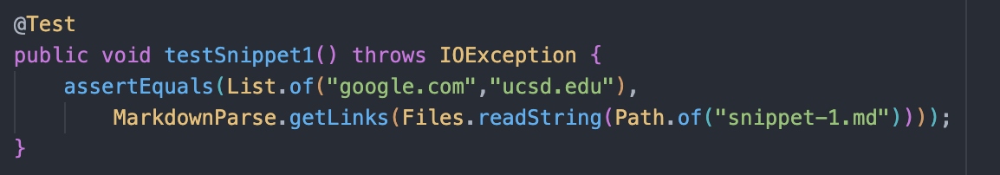

Below is a screenshot of running the unit tests on my implementation of markdown-parse. My code failed because it included the two invalid links and did not include "ucsd.edu".

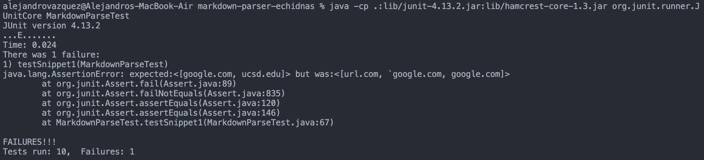

Below is a screenshot of running the unit tests on the repository I reviewed in week 7. Their code did a bit better because it captured "ucsd.edu", but like mine, it still included the two invalid links.

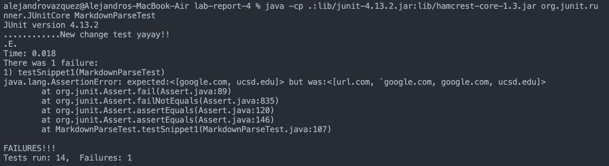

Snippet 2
---
Below is the VScode preview for snippet 2. Based on this preview, there are 3 links that should be considered valid based on correct syntax. These links are `a.com`, `a.com(())`, and `example.com`. However, `a.com(())` is not a valid link because it contains parenthesis, and therefore should not be returned by markdown-parse. This means the correct output should be:
```
[a.com, example.com]
```

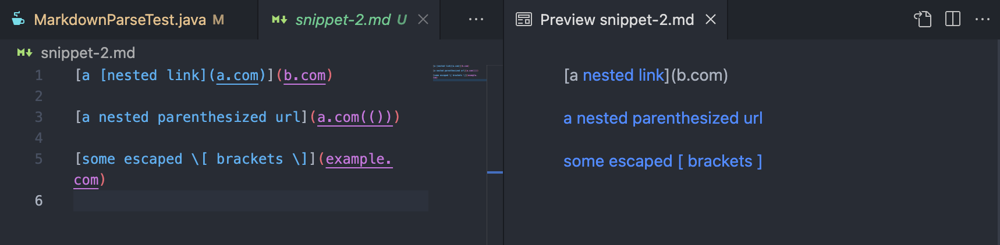

I turned it into a unit test using the following code:

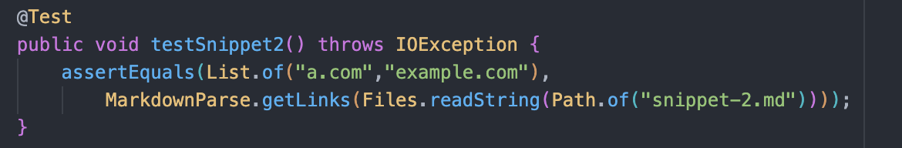

Below is a screenshot of running the unit tests on my implementation of markdown-parse. My code failed because it only included a portion of the invalid link `a.com(())`. My implementation likely got messed up by the extra parenthesis included in the link.

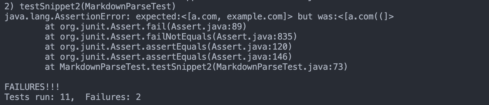

Below is a screenshot of running the unit tests on the repository I reviewed in week 7. Their implementation worked slightly better because it captured the 2 valid links, but it also captured the invalid link like mine did.

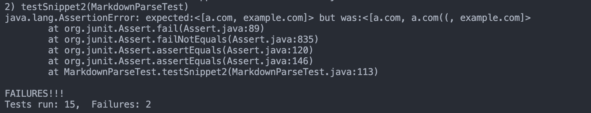

Snippet 3
---
Below is the VScode preview for snippet 3. According to the preview, there is only one valid link which should be captured by markdown-parse, which is `https://sites.google.com/eng.ucsd.edu/cse-15l-spring-2022/schedule`. The other two links do not have the correct markdown syntax and thus should not be returned by markdown-parse. The correct output should be:
```
[https://sites.google.com/eng.ucsd.edu/cse-15l-spring-2022/schedule]
```

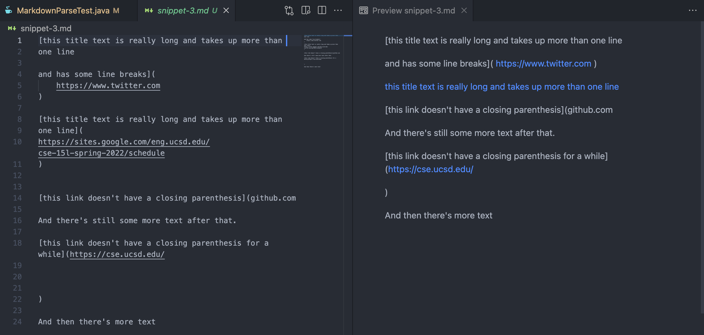

I turned it into a unit test using the following code:

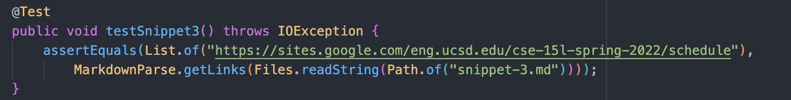

After running the test on my implementation of markdown-parse, it resulted in a failure because it did not capture the valid link. It actually did not capture any links at all unfortunately.

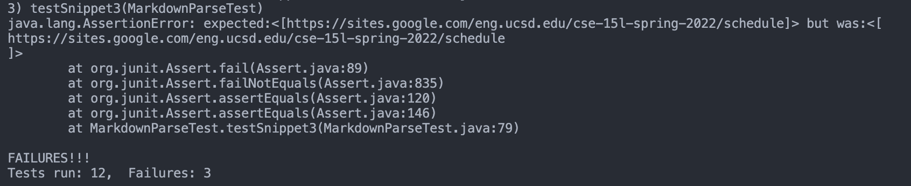

After running the test on the implementation of markdown-parse that I reviewed in week 7, it also resulted in a failure, but for a different reason. Their implementation actually captured the link correctly, but it also mistakenly captured the new line `\n` values which made it different than the expected output. This could probably be fixed by using a trim() method to remove leading and trailing spaces on a link before adding it to the list to be returned.


Question Answers
---
* A small change that could possibly fix the backtick issue is creating two new variables to track the index of a pair of backticks (if there is a pair), and before adding a link to the list that is returned, check to see if there are backticks that break up the brackets or parenthesis. If there is a pair of backticks, we would have to check if they are contained within the brackets or if they outside/inside the brackets. We could use an if-statement to check if there are backticks inside the URL; if the URL does contain backticks, then it won't be added to the list to be returned since URLs cannot have backticks.
* Because URLs cannot contain brackets or parentheses, this fix is pretty straight forward since all we have to do is check if the URL contains either. The solution for this would be to use an if-statement to check if the URL contains parentheses or brackets before adding it to the list to be returned. The if statement could look something like this: 
```
if (markdown.substring(openParen + 1, closeParen).contains("[") == false &&
    markdown.substring(openParen + 1, closeParen).contains("]") == false &&
    markdown.substring(openParen + 1, closeParen).contains("(") == false &&
    markdown.substring(openParen + 1, closeParen).contains(")") == false &&) {
      //add link to toReturn list
}
```
* A small change that could fix the newline error in snippet 3 is trimming the link before adding it to the list to be returned. Basically you can just add `.trim()` to the line `toReturn.add(markdown.substring(openParen + 1, closeParen)`, so it becomes `toReturn.add(markdown.substring(openParen + 1, closeParen).trim()`. This will ensure there aren't any leading or trailing in the link when you add it to the list. On the other hand, if you consider links with leading/trailing spaces to be invalid, we would have to check if the indices of the opening and closing parenthesis holding the link have no spaces between them and the link.
