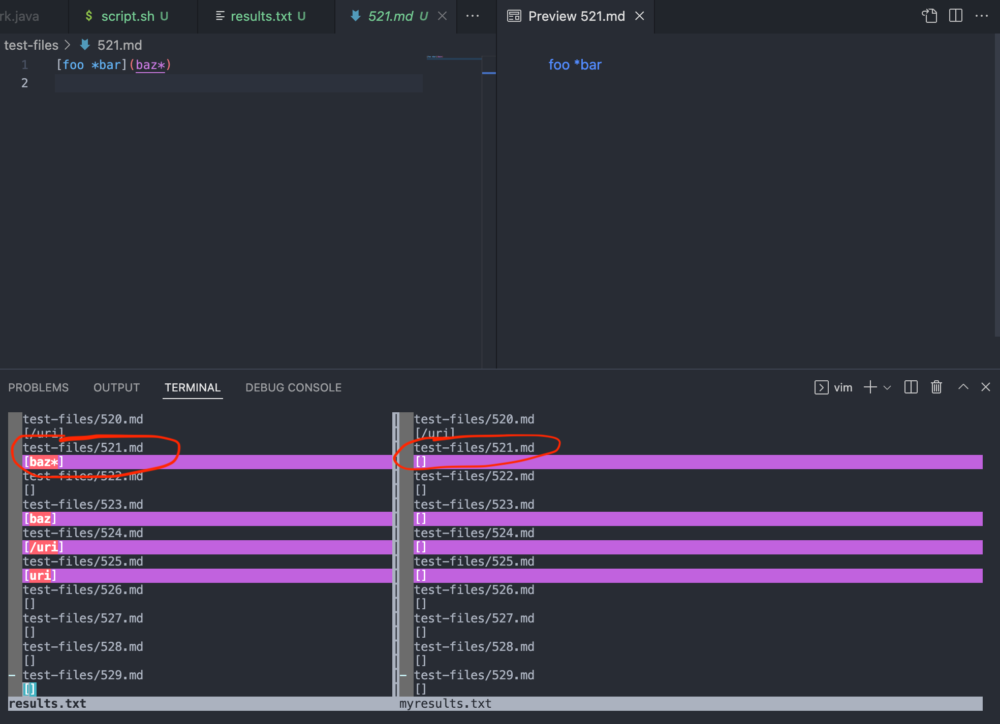
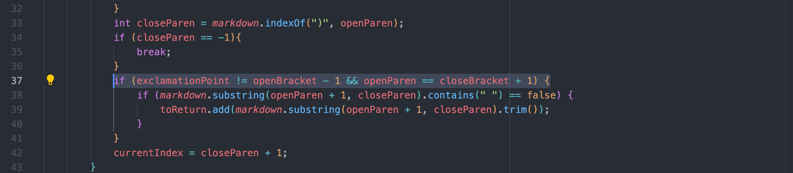
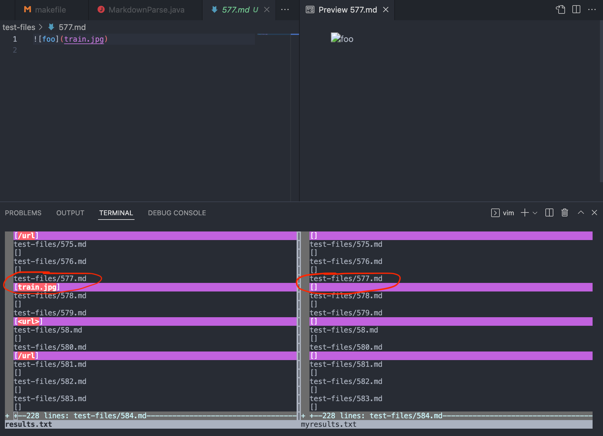
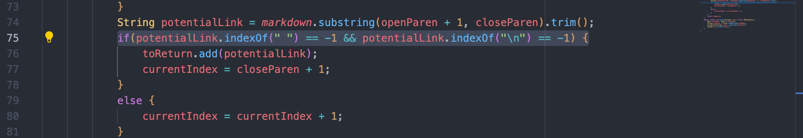

# Lab Report 5
This is the final lab report for CSE 15L

Using `vimdiff` to identify different outputs
---
To run MarkdownParse on all the test files, I used the bash.sh script which used a for-loop to run MarkdownParse on every test file. However, the results printed directly to the terminal and thus were difficult to view and disappeared past a certain point. To fix this, I saved the results to a text file using the `bash.sh > results.txt` command (see screenshot below).

I saved the results of the given MarkdownParse file to results.txt, and I saved the results of my implementation of MarkdownParse to myresults.txt. Then I used the command `vimdiff results.txt myresults.txt` to view the differences between the files (this command worked because I copied the files into the same directory). Below is what I saw:

Failure Inducing Test File 1
---
The first file I found that has incorrect output is test file 521, which can be found [here](https://github.com/nidhidhamnani/markdown-parser/blob/main/test-files/521.md). Below is a screenshot of the test file and the difference seen through `vimdiff`.

The actual output for the given implementation of MarkdownParse is: `[baz*]`

The actual output for my implementation of MarkdownParse is: `[]`

Based on the preview of the test file, the correct output should be `[baz*]`, meaning the given implementation of MarkdownParse works properly and my implementation does not. After looking for the bug in my implementation of MarkdownParse, I found an issue with the following code segment: 

In line 37, I have an if-statement that checks if the link is an image or an actual URL before adding it to the list. Because MD files distinguish images from links by an exclamation mark before the opening bracket, this if-statement checks if the index before the open bracket is an exclamation mark. To get the index of the exclamation mark, I included the line `int exclamationPoint = markdown.indexOf("!",currentIndex);` towards the beginning of the method. However, the bug is that I failed to account for situations where the open bracket for a link is at index 0, and since there is no exclamation point then the variable `exclamationPoint` equals -1, thus causing `exclamationPoint` to be equal to `openBracket - 1` even though the open bracket is not preceded by an exclamation point.

Failure Inducing Test File 2
---
The second file I found that has incorrect output is test file 577, which can be found [here](https://github.com/nidhidhamnani/markdown-parser/blob/main/test-files/577.md). Below is a screenshot of the test file and the difference seen through `vimdiff`.

The actual output for the given implementation of MarkdownParse is: `[train.jpg]`

The actual output for my implementation of MarkdownParse is: `[]`

In this case, my output is correct because it does not add the link since it is an image. The given implementation of MarkdownParse incorrectly adds the link even though it is from an image. The issue can be fixed by editing the following code segment:

We can fix this bug by adding a new variable that tracks the index of the next exclamation point, like the one I have in my file. Then before adding `potentialLink` to the array `toReturn`, add another condition to the if-statement in line 75 that checks if there is an exclamation point at the index before `nextOpenBracket`. If there is, do not add the link to the array. Otherwise it is a valid link and should be added.
