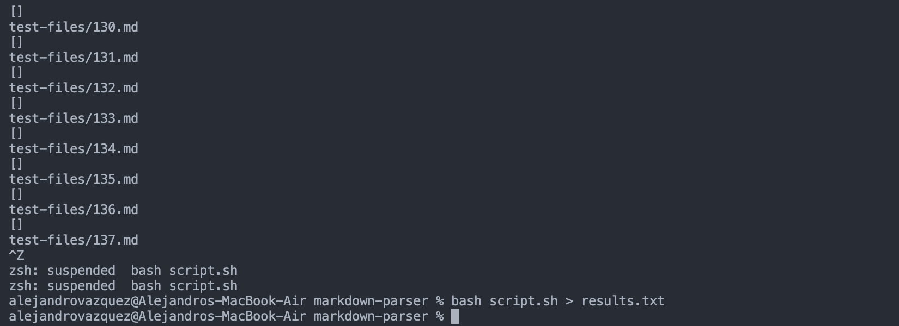
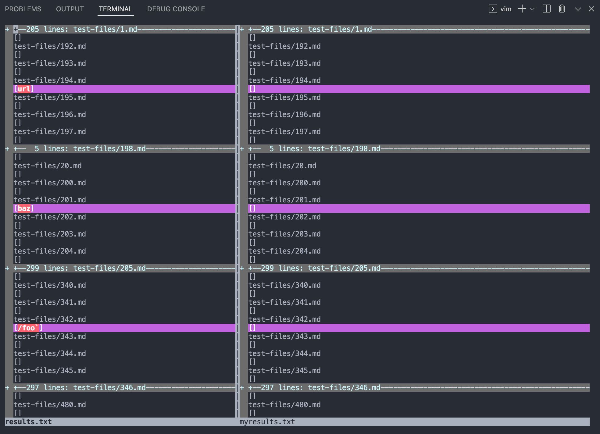

# Lab Report 5
This is the final lab report for CSE 15L

Using `vimdiff` to identify different outputs
---
To run MarkdownParse on all the test files, I used the bash.sh script which used a for-loop to run MarkdownParse on every test file. However, the results printed directly to the terminal and thus were difficult to view and disappeared past a certain point. To fix this, I saved the results to a text file using the `bash.sh > results.txt` command (see screenshot below).

I saved the results of the given MarkdownParse file to results.txt, and I saved the results of my implementation of MarkdownParse to myresults.txt. Then I used the command `vimdiff results.txt myresults.txt` to view the differences between the files (this command worked because I copied the files into the same directory). Below is what I saw:

